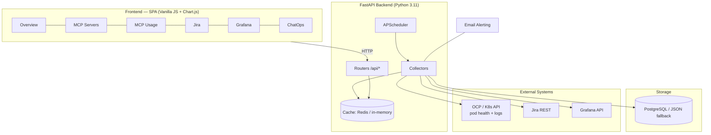
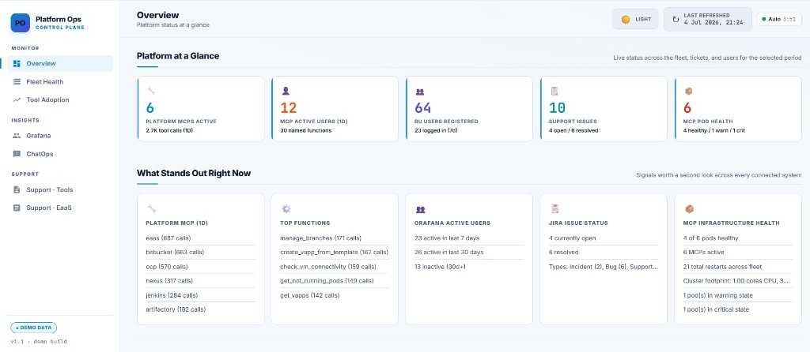
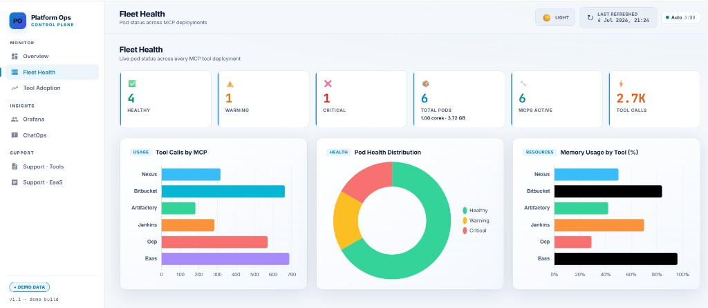
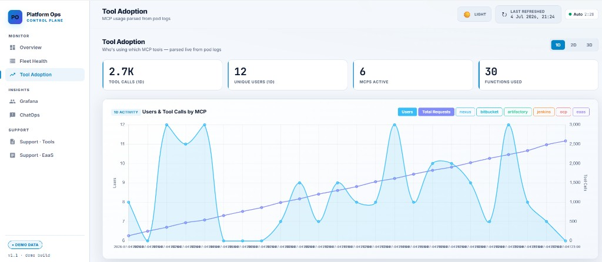
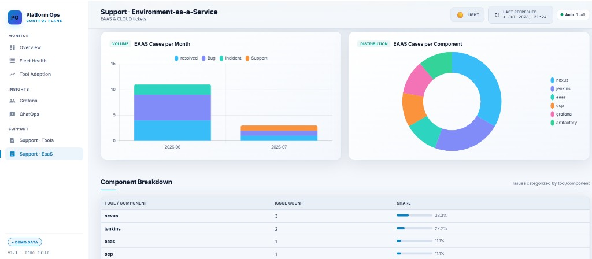

# Platform Operations Dashboard

> A single pane of glass for a platform team: real-time Kubernetes/OpenShift pod health, MCP microservice usage analytics, support-ticket trends, and user adoption — behind one FastAPI backend, with health-based alerting and graceful degradation.

<p align="left">
  
  
  
  
  
</p>

**Try it in 2 minutes, no credentials required** — see [Quick Start (Demo Mode)](#quick-start-demo-mode).

---

## Table of Contents

1. [The Problem](#the-problem)
2. [The Solution](#the-solution)
3. [Impact](#impact)
4. [Skills Demonstrated](#skills-demonstrated)
5. [Architecture](#architecture)
6. [Quick Start (Demo Mode)](#quick-start-demo-mode)
7. [Screenshots](#screenshots)
8. [Incident Write-up & Runbook](#incident-write-up--runbook)
9. [Dashboard Tabs](#dashboard-tabs)
10. [Configuration (Live Mode)](#configuration-live-mode)
11. [API Reference](#api-reference)
12. [Data Sources & Collectors](#data-sources--collectors)
13. [Health Scoring & Alerting](#health-scoring--alerting)
14. [Deployment](#deployment)
15. [Project Structure](#project-structure)
16. [Adding a New MCP Tool](#adding-a-new-mcp-tool)
17. [Troubleshooting](#troubleshooting)

---

## The Problem

A platform team runs a fleet of internal **MCP (Model Context Protocol) microservices** on Kubernetes/OpenShift — tools that wrap Nexus, Bitbucket, Artifactory, Jenkins, OpenShift, and an Environment-as-a-Service system. Operating them day-to-day meant answering questions that lived in five different places:

- *Are all the tool pods healthy right now?* → `oc get pods` across six namespaces, by hand.
- *Which tools are actually being used, by whom, and how often?* → grepping pod logs before they rolled off (1–3 day retention).
- *How many support tickets are we getting, and for which tool?* → Jira JQL, manually.
- *Is anyone even using the Grafana we stood up?* → the Grafana admin API, manually.

There was **no consolidated view**, no historical trend once logs expired, and **no proactive alerting** — a crash-looping pod was noticed only when a user complained.

## The Solution

A lightweight observability platform built *as a product for the team*:

- **Collects** pod health + live CPU/memory from the Kubernetes API, parses usage from pod logs, and pulls Jira and Grafana data on a schedule.
- **Persists** snapshots so trends survive the cluster's short log retention.
- **Serves** everything through one FastAPI backend and a single-page dashboard with five tabs.
- **Alerts** on unhealthy pods using a rate-aware health model (so a long-lived pod with a few restarts isn't treated like a crash-loop), with per-tool ownership routing and cooldown suppression.
- **Degrades gracefully**: PostgreSQL is optional (falls back to JSON files), Redis is optional (falls back to an in-memory TTL cache), and a bundled **demo mode** runs the whole thing with zero external systems.

## Impact

- Consolidated **6 MCP microservices across 6 namespaces** into one dashboard, replacing manual `oc`/log/JQL digging.
- Cut **time-to-detect an unhealthy pod** from "when a user complains" to **≈1 polling cycle (5 min)** via automated health scoring + email alerts.
- Preserved **usage history beyond the cluster's 1–3 day log retention** through scheduled DB snapshots.
- Gave leadership a self-serve **executive summary** (adoption, ticket trends, fleet health) that previously took a manual weekly report.

---

## Skills Demonstrated

| Area | What this project shows |
|---|---|
| **Platform engineering** | Built a self-serve "single pane of glass" *for* a team; adding a new tool is one config line |
| **Kubernetes / OpenShift ops** | Pod health, readiness, restarts, live CPU/memory via the K8s + Metrics APIs; ServiceAccount tokens |
| **Observability** | Metrics + log-derived usage analytics + user-adoption tracking, all as time-series |
| **SRE / alerting** | Rate-aware health model, per-owner alert routing, cooldown suppression, resolve notifications |
| **Backend engineering** | FastAPI, async endpoints, APScheduler background collectors, clean collector/router separation |
| **Resilience** | Optional Postgres→JSON and Redis→in-memory fallbacks; non-blocking background collection |
| **Containerization & deploy** | Multi-stage-friendly Docker image, healthchecks, resource limits, Compose + systemd + remote deploy |
| **DevEx** | Bundled demo mode so anyone can run the full app with no credentials |

---

## Architecture



**Key design decisions**

- **Pod logs are the primary usage source.** Log retention is short (1–3 days), so a scheduler snapshots parsed stats to the DB for history.
- **Non-blocking API.** Endpoints serve from cache instantly; a cache miss kicks off background collection and returns immediately, so the event loop never blocks on upstream systems.
- **Everything optional.** No DB, no Redis, no cloud account required to run it.

<sub>The Mermaid diagram above renders on GitHub. An ASCII version is kept in the [original layout](#dashboard-tabs) below for reference.</sub>

---

## Quick Start (Demo Mode)

Demo mode seeds realistic mock data into the cache and disables all live collectors — **no OpenShift, Jira, Grafana, DB, or credentials needed.**

### With Docker

```bash
cp .env.example .env          # DEMO_MODE=true is already the default
docker compose up -d --build
# open http://localhost:9200
```

### Locally (Python 3.11+)

```bash
python -m venv .venv
# Windows: .venv\Scripts\activate    |    macOS/Linux: source .venv/bin/activate
pip install -r requirements.txt

cp .env.example .env          # DEMO_MODE=true by default
python -m app.main
# open http://localhost:9100   (Swagger docs at /docs)
```

Every tab lights up with sample fleet health (including one warning and one critical pod so the alerting story is visible), usage analytics, tickets, users, and ChatOps activity. Flip `DEMO_MODE=false` in `.env` and fill in real endpoints to run it live.

---

## Screenshots

All captures below are from the app running in **demo mode** — every value is synthetic, no production systems are connected.

### Overview — platform status at a glance
KPI strip (MCPs active, users, tickets, pod health) plus a "what stands out right now" panel that surfaces signals across every connected system.



### Fleet Health — pod status across MCP deployments
Live health counters, tool-call volume, a pod-health donut (healthy / warning / critical), and per-tool memory usage. The seeded data intentionally includes one warning and one critical pod so the alerting story is visible.



### Tool Adoption — usage parsed from pod logs
Unique users and tool-call trends over time, broken down per MCP tool and top functions.



### Support — Environment-as-a-Service
Ticket volume by month, distribution by component, and a component breakdown table (mirrored by a Platform-Tools support view).



<sub>Tip: a 2-minute screen recording linked at the top of this README makes the strongest impression in interviews.</sub>

---

## Incident Write-up & Runbook

A short, blameless post-incident note — the kind of artifact platform/SRE interviewers love to see.

### Incident: MCP tabs went blank across the dashboard

**Impact:** For ~40 minutes, the *MCP Servers* and *MCP Usage* tabs showed no data. Jira/Grafana tabs were unaffected.

**Detection:** The dashboard's own health check (`/api/mcp/metrics`) returned an empty summary; API logs showed repeated `HTTP 401` responses from the OpenShift API.

**Root cause:** The static OpenShift bearer token had expired (~24 h lifetime). Every K8s API call was rejected, so no pod health or logs could be collected. The UI correctly rendered "no data" rather than crashing.

**Resolution:** Rotated to a **service-account token with auto-refresh** (`OCP_SA_USER` / `OCP_SA_PASSWORD`), so the app now obtains and refreshes its own bearer token on a schedule and force-refreshes on a 401/403.

**Why it didn't cascade:** Collectors are isolated and cached independently — a failure in the OCP collector never took down the Jira or Grafana tabs, and the API kept serving the last good cached snapshot.

**Follow-ups / prevention**
1. Prefer service-account auto-refresh over static tokens (done).
2. Add an alert when `/api/mcp/metrics` reports `total_pods == 0` for more than one cycle.
3. Surface token status in the UI (the `/api/mcp-stats/diagnostics` endpoint already reports `token_status`).

**Runbook — "MCP tabs show no data"**
1. `GET /api/mcp-stats/diagnostics` → check `token_status`.
2. If `EXPIRED_OR_INVALID`, run `./refresh-ocp-token.sh` or set SA credentials and restart.
3. Confirm recovery on `/api/mcp/metrics` (non-zero `total_pods`).

---

## Dashboard Tabs

**1. Overview (Executive Summary)** — top-level cards (active MCPs, active users, registered users, support issues, pod health) plus a combined "Platform Highlights" panel.

**2. MCP Servers (Health & Metrics)** — real-time pod health from the K8s API: rate-aware Healthy/Warning/Critical status, CPU/memory bars from the Metrics API, pod count, readiness, age, restart rate, and charts (calls by tool, health distribution, memory by tool).

**3. MCP Usage (Adoption)** — usage parsed from pod logs, filterable by 1D/2D/3D: platform totals, per-tool deep-dive (functions, top users), and a searchable per-user activity table. Service accounts are filtered from user charts.

**4. Jira Cases (Trends & Tools)** — issues from configured projects, period-filterable: monthly trend, issues by tool/component, and a searchable/paginated ticket table.

**5. Grafana (User Logins)** — non-admin login tracking: active-7d/30d/inactive distribution, last-seen timeline, top users, and a filterable user table.

**6. ChatOps (Assistant Analytics)** — optional tab tracking a chat-assistant's message volume, channels, MCP adoption, and service health.

---

## Configuration (Live Mode)

Copy `.env.example` to `.env` and set `DEMO_MODE=false`, then fill in credentials.

| Variable | Description | Example |
|----------|-------------|---------|
| `DEMO_MODE` | Serve mock data, no external systems | `true` / `false` |
| `JIRA_BASE_URL` / `JIRA_USERNAME` / `JIRA_API_TOKEN` | Jira REST auth | `https://jira.example.com` |
| `JIRA_PROJECTS` | Comma-separated project keys | `DEVOPS,EAAS,CLOUD` |
| `OCP_API_URL` | OpenShift Kubernetes API URL | `https://console-openshift-console.apps.ocp-cluster.example.com/api/kubernetes` |
| `OCP_TOKEN` **or** `OCP_SA_USER`/`OCP_SA_PASSWORD` | Static token *or* auto-refresh service account | `sha256~...` |
| `OCP_MCP_TOOLS` | MCP tool names (namespace pattern `{tool}-mcp`) | `nexus,bitbucket,artifactory,jenkins,ocp,eaas` |
| `GRAFANA_BASE_URL` / `GRAFANA_API_KEY` | Grafana admin-level API key | `https://grafana.example.com` |
| `DATABASE_URL` | PostgreSQL URL; blank = JSON fallback | *(blank)* |
| `REDIS_URL` | Redis URL; blank = in-memory cache | *(blank)* |
| `ALERT_*` | SMTP host, sender, per-tool owners, cooldown | see `.env.example` |

### Obtaining an OpenShift token

**Option A — Static token (expires ~24 h):** OCP web console → *Copy login command* → *Display Token* → copy the `sha256~...` value into `OCP_TOKEN`.

**Option B — Service account (recommended, auto-refresh):**

```bash
oc create serviceaccount platform-monitoring-sa -n nexus-mcp
for NS in nexus-mcp artifactory-mcp jenkins-mcp bitbucket-mcp ocp-mcp eaas-mcp; do
  oc adm policy add-role-to-user view system:serviceaccount:nexus-mcp:platform-monitoring-sa -n $NS
done
oc adm policy add-cluster-role-to-user system:aggregate-to-view \
  system:serviceaccount:nexus-mcp:platform-monitoring-sa
```

---

## API Reference

All endpoints return JSON. Interactive docs at `/docs` (Swagger) or `/redoc`.

### MCP Pod Health (`/api/mcp`)
| Method | Path | Description |
|---|---|---|
| GET | `/api/mcp/status` | Full pod health: `{ servers, summary }` |
| GET | `/api/mcp/metrics` | Summary counts + CPU/memory (used by the healthcheck) |
| GET | `/api/mcp/tools` | Discovered MCP tools |

### MCP Usage (`/api/mcp-stats`) — accepts `?days=1..3` or `?from=&to=`, optional `&app=`
| Method | Path | Description |
|---|---|---|
| GET | `/api/mcp-stats/summary` | Totals: calls, unique users/apps/functions |
| GET | `/api/mcp-stats/daily` | Time-series (users + calls) |
| GET | `/api/mcp-stats/applications` | Calls per tool |
| GET | `/api/mcp-stats/functions` | Calls per function |
| GET | `/api/mcp-stats/users` | Calls per user with top functions |
| GET | `/api/mcp-stats/diagnostics` | Pod age/restarts, log volume, token status |

### Jira (`/api/jira`), Grafana (`/api/grafana`), ChatOps (`/api/chatops`)
| Method | Path | Description |
|---|---|---|
| GET | `/api/jira/trends` \| `/by-tool` \| `/open` \| `/issues` \| `/projects` | Ticket analytics |
| GET | `/api/grafana/users` \| `/panels` | User logins + embeddable panels |
| GET | `/api/chatops/summary` \| `/activity` \| `/channels` \| `/mcp` \| `/health` | Assistant analytics |
| POST | `/api/refresh` | Force re-collect (re-seeds in demo mode) |

---

## Data Sources & Collectors

- **`ocp_mcp_collector.py`** — primary usage source. Discovers pods per `{tool}-mcp` namespace, fetches logs via the K8s API, and parses lines like `Recording MCP stats for <user> - App: <app> Function: <function>` (falls back to counting `CallToolRequest`). Protocol calls (`ping`, `initialize`, `tools/list`, …) are filtered out.
- **`mcp_router.py`** — pod detail + live CPU/memory from the K8s + Metrics APIs, with the health model below.
- **`jira_collector.py`** — Jira REST issues (classified to a "tool" from summary/components/labels).
- **`grafana_collector.py`** — non-admin users + last-seen; optional dashboard panels.
- **`chatops_collector.py`** — proxies a chat-assistant analytics API via the K8s pod proxy.
- **`scheduler.py`** — APScheduler runs collectors periodically (default 5 min); first run ~3 s after startup.

---

## Health Scoring & Alerting

Health is computed from **restarts per day**, not raw restart count, so a long-lived pod that accumulated a few restarts isn't penalized like a crash-loop:

| Signal | Warning | Critical |
|---|---|---|
| Restart rate (per day) | > 4 | > 10 |
| Memory usage | > 80% | > 95% |
| Pod phase / readiness | not ready | not Running |

Email alerting (`alerting.py`) sends one email per incident when a pod enters warning/critical, routes to **per-tool owners** (`ALERT_OWNERS`), suppresses repeats for `ALERT_COOLDOWN_HOURS`, and sends a resolve notice when a pod recovers.

---

## Deployment

```bash
# Docker Compose (production)
cp .env.example .env    # set DEMO_MODE=false and real values
docker compose down && docker compose up -d --build
docker compose logs -f --tail=100

# Remote deploy (rsync + SSH)
./deploy.sh

# systemd service
sudo bash deploy-systemd.sh
```

The image includes a healthcheck (`curl /api/mcp/metrics`) and resource limits are set in `docker-compose.yml`.

---

## Project Structure

```
platform-ops-dashboard/
├── app/
│   ├── main.py                  # FastAPI app, lifespan, demo-mode wiring, /api/refresh
│   ├── config.py                # Pydantic settings (incl. DEMO_MODE)
│   ├── demo_data.py             # Mock-data seeding for demo mode
│   ├── database.py              # PostgreSQL + JSON file fallback
│   ├── cache.py                 # Redis + in-memory TTL fallback
│   ├── scheduler.py             # APScheduler background jobs
│   ├── ocp_token_manager.py     # Bearer-token acquisition + auto-refresh
│   ├── alerting.py              # Pod-health email alerts
│   ├── collectors/              # ocp_mcp, mcp, mcp_stats, jira, grafana, chatops
│   └── routers/                 # dashboard, mcp, mcp_stats, jira, grafana, chatops
├── static/                      # dashboard.css, dashboard.js (Chart.js SPA), favicon
├── templates/dashboard.html     # Jinja2 template (tabs)
├── docs/screenshots/            # UI captures used in this README
├── docker-compose.yml           # single service, port 9200
├── Dockerfile                   # python:3.11-slim + healthcheck
├── requirements.txt
└── .env.example                 # config template (DEMO_MODE=true by default)
```

---

## Adding a New MCP Tool

1. Add the tool name to `OCP_MCP_TOOLS` in `.env` (namespace must be `{tool}-mcp`).
2. Ensure the MCP logs `Recording MCP stats for <user> - App: <app> Function: <fn>` per call.
3. Grant the ServiceAccount `view` on the new namespace.
4. Rebuild — the tool appears in all tabs after the next collection cycle.

---

## Troubleshooting

| Symptom | Likely cause | Fix |
|---|---|---|
| MCP tabs blank | OCP token expired | See the [runbook](#incident-write-up--runbook) |
| Pods show `0m` CPU / empty metrics | Metrics API not reachable with token | Grant `system:aggregate-to-view` |
| `_unknown` users in usage | MCP tool doesn't log stats lines | Enable stats logging on that MCP |
| Stale data | Cache/snapshot | Click refresh or `POST /api/refresh` |
| Port mismatch | 9100 local vs 9200 in Docker | Align `.env` / firewall |

---

*Platform Operations Dashboard — a portfolio project demonstrating platform engineering and operations. All hostnames, credentials, and organization names are generic placeholders; run it instantly with `DEMO_MODE=true`.*
